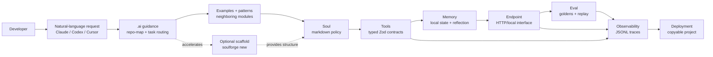
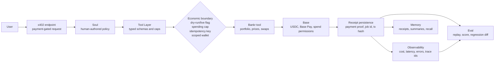

<p align="center">
  <strong>SoulForge</strong>
</p>

<p align="center">
  <em>An AI-native agent engineering substrate for building observable, replayable, Base-native agents.</em>
</p>

---

## What this is

SoulForge is a production-conscious repository architecture for AI-assisted agent engineering. Its primary interface is not a framework import or a scaffold command. Its primary interface is a cloned repo plus a natural-language instruction to a coding agent:

> "Claude, build me a Base-native research agent with memory and x402 payments."

> "Codex, create a long-horizon monitoring agent with Bankr integration and evals."

The repository itself is part of the product. Its folders, contracts, examples, evals, observability, and `.ai/` guidance are arranged so Claude, Codex, Cursor, OpenAI agents, and local coding agents can navigate the system quickly and create high-quality agents with fewer architectural mistakes.

The thesis:

> primitives + working examples > framework lock-in

SoulForge is not a runtime. It is not a template CLI dressed up as a product. The repo provides copyable primitives, typed reference implementations, runnable examples, eval harnesses, observability, memory, and machine-readable guidance that make AI-generated agents dramatically more reliable and production-grade.

---

## Design principles

**Agents should be easy to create, hard to create incorrectly.** The repo gives AI systems deterministic structure, strong contracts, naming conventions, eval expectations, and observability requirements so natural-language requests land as coherent implementations.

**The repository structure is product surface.** `.ai/`, `docs/`, examples, contracts, tests, and naming conventions are designed as a navigation system for autonomous coding agents.

**Primitives over frameworks.** SoulForge produces copyable infrastructure, not a package that every agent must import.

**Human-readable souls.** Souls stay markdown-first. Schema validates structure, but humans remain the primary authors.

**Provider-agnostic policy.** Souls do not encode OpenAI, Anthropic, Gemini, local model, or hosted-tool assumptions. Examples can pin providers. Primitives should not.

**Economic actions must be observable.** If agents can move money, execution must be replayable, actions must emit telemetry, receipts must persist, limits must be enforceable, and approvals must be explicit.

---

## Build Your First Agent With an AI Coding Agent

```bash
git clone https://github.com/0xAxiom/soulforge.git
cd soulforge
npm install
```

Then ask your coding agent:

```text
Build a Base-native research agent with memory, x402 payments, eval goldens, and JSONL observability.
```

The agent should read:

1. `README.md`
2. `CLAUDE.md`
3. `docs/ARCHITECTURE.md`
4. `.ai/repo-map.json`
5. `.ai/task-routing.md`
6. the nearest module README for each primitive it touches

The implementation should produce a standalone agent or reference example with this shape:

| File | Purpose |
| --- | --- |
| `soul.md` | Human-readable behavior, scope, and refusal policy |
| `src/contracts.ts` | Zod input/output schemas |
| `src/tools.ts` | Isolated tool wiring |
| `src/memory.ts` | Local memory lifecycle |
| `src/endpoint.ts` | Request handler composition |
| `src/observability.ts` | JSONL trace sink |
| `src/eval.ts` | Local replay runner |
| `eval/goldens/` | Golden cases, including refusal cases |
| `.env.example` | Runtime knobs and safe defaults |

The scaffold command is a supporting accelerator when the coding agent wants a known-good starting point:

```bash
npx soulforge new base-research --template research-agent
npx soulforge new paid-agent --template x402-paid-agent
npx soulforge new dry-run-trader --template trading-agent
```

Generated projects are examples of the expected structure. They are not the core product and they are not a runtime dependency.

---

## Repository Layout

```text
soulforge/
├── .ai/                      machine-readable guidance for coding agents
├── CLAUDE.md                 operating contract for AI contributors
├── docs/                     architecture and release docs
├── generator/                optional scaffold accelerator and template examples
├── souls/                    markdown souls, schema, validator
├── tools/                    optional typed capability modules
├── endpoints/                endpoint templates and working demos
├── memory/                   short-term, long-term, recall, reflect
├── eval/                     traces, goldens, score, diff, cache
├── observability/            JSONL cost, latency, error, receipt events
└── research/                 implementation research notes
```

The implementation folders are peers. No primitive secretly owns the others.

---

## Operational Modules

| Module | Status | Verification |
| --- | --- | --- |
| `souls/` | Schema, examples, validate CLI | `npm run validate-souls` |
| `memory/` | Local-first memory contracts: Map KV, SQLite long-term, recall, reflection, telemetry | `npm run test -- memory` |
| `eval/` | JSONL traces, goldens, scoring, diff, cache | `npm run eval -- run --soul souls/examples/starter-soul.md` |
| `observability/` | JSONL sink, cost ledger, latency histogram, error grouping | `npm run test -- observability` |
| `tools/bankr/` | Dry-run-first Bankr adapter with receipts and guardrails | `npm run test -- tools/bankr` |
| `tools/workflow-runner/` | Deterministic multi-step workflow runtime with checkpoint-based resume | `npm run test -- tools/workflow-runner` |
| `tools/workflow-validator/` | Build-time validation for WorkflowDefinitions — catches wiring errors before execution | `npm run test -- tools/workflow-validator` |
| `tools/production-evaluator/` | In-production post-response evaluators: extract facts and quality signals from live turns | `npm run test -- tools/production-evaluator` |
| `generator/` | Optional scaffold accelerator and six structure examples | `npm run scaffold:smoke` |
| `endpoints/` | Endpoint contracts, x402 template, URL inspector examples | `npm run test -- endpoints` |

Quality gates:

```bash
npm run lint
npm run typecheck
npm run test
npm run build
npm run validate-souls
```

---

## Architecture Invariants

Never:

- add hidden runtimes
- bypass eval
- bypass observability
- use unstructured tool outputs
- hardcode providers into souls
- create giant god-agents
- skip replayability
- skip idempotency for financial actions

Always:

- use structured outputs
- emit telemetry
- create eval goldens
- keep tools isolated
- keep primitives composable
- preserve local-first operability
- document env vars and failure behavior

---

## How AI Coding Agents Should Work Here

When modifying SoulForge:

1. Read `README.md`.
2. Read `CLAUDE.md`.
3. Read `docs/ARCHITECTURE.md`.
4. Read `.ai/repo-map.json` and the relevant `.ai/*.md` guide.
5. Inspect neighboring modules before adding abstractions.
6. Preserve primitive boundaries.
7. Add tests for code changes.
8. Add eval goldens for agent behavior changes.
9. Add observability for runtime paths.
10. Update docs in the same change.

Use `.ai/` for machine guidance, examples for local patterns, `generator/` only when a scaffold speeds up implementation, and the primitive folders for real code.

---

## AI-Native Development Flow



---

## Reference Patterns

### Pattern: Memory-backed agent

Use short-term memory for active turn state, SQLite long-term memory for durable records, recall for deterministic retrieval, and reflection for manual session summarization. Include provenance and trace identifiers on persisted records.

### Pattern: Paid x402 endpoint

Validate request input, verify payment, execute the tool, persist a receipt, emit observability, and score the behavior with eval goldens. Never execute the paid tool before payment validation.

### Pattern: Planner/executor split

Planner emits typed tasks. Executor performs bounded tool calls. Planner reviews the result. Eval scores the full trace. Memory stores handoffs and failure escalations.

### Pattern: Economic action

Default to dry-run. Require live flag, spending cap, network allowlist, idempotency key, scoped wallet or sub-account, receipt persistence, and telemetry.

---

## Economic Agents on Base

SoulForge treats Base as first-class agent infrastructure: payment, identity, scoped wallets, spend permissions, receipts, and paid service calls are part of the execution model. The goal is not to make hype-driven trading bots. The goal is to make economic agents inspectable, replayable, and bounded enough for serious software teams to operate.

Base-native agents can compose:

| Capability | SoulForge boundary |
| --- | --- |
| Receive payments | x402 endpoint manifests, Base Pay, and receipt capture |
| Manage scoped wallets | Sub-accounts or task wallets with limited balances |
| Use spend permissions | Explicit allowances, expirations, revocation, and inspection |
| Perform controlled swaps | Typed tool calls, simulation first, dry-run default |
| Execute strategies | Idempotent action keys, spending caps, live-mode gates |
| Persist execution receipts | JSONL receipts that memory, eval, and observability replay |
| Coordinate paid calls | x402 client/server flows with hard spending caps |

Financial actions are never autonomous by default, unlimited, hidden, or unobservable.

> SoulForge treats financial execution like infrastructure operations, not "AI magic."



---

## Bankr Integration

`tools/bankr/` is an optional programmable-finance adapter. It exposes typed, dry-run-first primitives for price checks, portfolio reads, swap simulation, guarded live swap submission, and execution receipts.

Guardrails:

- dry-run default
- Base and Base Sepolia allowlist
- explicit `live: true` for execution
- `spendingCapUsd` required for live swaps
- `idempotencyKey` required for live swaps
- no direct sign/submit API exposed
- observability on success and failure

Run:

```bash
npm run test -- tools/bankr
npx tsx tools/bankr/examples/dry-run-swap.ts
```

---

## File Naming Conventions

| Artifact | Convention |
| --- | --- |
| Soul | `souls/examples/<agent-name>-soul.md` or generated `soul.md` |
| Tool module | `tools/<tool-name>/src/index.ts` |
| Tool test | `tools/<tool-name>/src/<tool-name>.test.ts` |
| Endpoint example | `endpoints/examples/<agent-name>/` |
| Eval golden | `eval/goldens/<soul-name>/golden-001.json` |
| Generated golden | `<agent>/eval/goldens/golden-001.json` |
| Telemetry | `~/.soulforge/obs/YYYY-MM-DD.jsonl` |
| Research note | `research/YYYY-MM-DD-topic.md` |

---

## Implementation Contracts

Every primitive documents:

| Contract | Required answer |
| --- | --- |
| Inputs | What schemas or types are accepted? |
| Outputs | What structured object is returned? |
| Side effects | What can be written, called, paid, or posted? |
| Persistence | What survives process exit? |
| Observability | Which events are emitted? |
| Failure behavior | What error shape or refusal path is used? |
| Replay guarantees | What can eval or a human reproduce later? |

AI contributors should not infer these. Add or update the contract when behavior changes.

---

## Agent Quality Checklist

Machine-readable checklist for every generated or reference agent:

- [ ] soul is markdown and validates if placed under `souls/examples/`
- [ ] tools have typed input and output schemas
- [ ] endpoint validates before execution
- [ ] tests cover success and refusal/failure
- [ ] eval goldens include at least one refusal case
- [ ] observability emits trace identifiers
- [ ] memory lifecycle is explicit
- [ ] external calls are mockable
- [ ] economic actions default to dry-run
- [ ] live economic actions require caps and idempotency
- [ ] README includes env docs and verification commands

---

## Why This Repo Works Well With AI Coding Agents

Most repos are difficult for AI because architecture is implicit: inconsistent layout, weak typing, hidden side effects, no evals, poor observability, and unclear ownership boundaries.

SoulForge optimizes for:

- explicit primitives
- deterministic structure
- machine-readable repo maps
- natural-language task routing
- strong TypeScript and Zod contracts
- local-first memory and observability
- replayable evals
- isolated tools
- highly legible examples and optional scaffolds

AI agents should generate understandable systems, not opaque magic stacks.

License: MIT.
