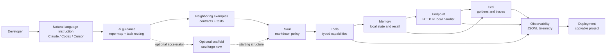

# SoulForge Architecture

SoulForge is an AI-native agent engineering substrate. Its primary user experience is a developer giving a natural-language instruction to Claude, Codex, Cursor, an OpenAI agent, or another coding system inside this repo. The architecture exists to make that agent successful: quick navigation, explicit contracts, predictable file placement, eval-backed development, observable execution, and replayable workflows.

SoulForge is not centered on a CLI or framework runtime. The generator is a supporting accelerator. The repository structure is the product surface.

## Layers

```text
AI guidance     -> .ai/
optional scaffold -> generator/
agent policy    -> souls/
capabilities    -> tools/
interfaces      -> endpoints/
state           -> memory/
verification    -> eval/
telemetry       -> observability/
research        -> research/
```

Implementation belongs in the primitive folders. `.ai/` is the machine-readable navigation layer. `generator/` is an optional source of known-good starting structures and smoke-tested examples. Neither orchestrates agents at runtime.

## Composition



## Primitive Contracts

| Primitive | Inputs | Outputs | Side effects | Replay guarantee |
| --- | --- | --- | --- | --- |
| `souls/` | Markdown with validated frontmatter | Human-readable policy | None | Versioned markdown diffs |
| `tools/` | Typed schema inputs | Schema-validated objects | External calls, local side effects | Receipts and typed errors |
| `endpoints/` | HTTP/local requests | Structured responses | Tool calls, payment checks | Request and receipt traces |
| `memory/` | Records, transcripts, recall text | JSON/SQLite records | Local persistence | Provenance and transcript hashes |
| `eval/` | Souls and goldens | Scores, traces, cache | Local JSONL/cache writes | Deterministic replay |
| `observability/` | Cost, latency, error, receipt events | JSONL events | Local append-only files | Trace/session/turn IDs |

## Economic Boundary

Base-native economic actions are tool calls, not soul fields and not framework lifecycle hooks. A soul may define policy and refusal conditions. A tool owns executable contracts and safety checks.

```text
soul policy -> typed economic tool -> cap/payment boundary -> Base/Bankr -> receipt -> obs/eval/memory
```

Required controls:

- dry-run default
- explicit live flag
- network allowlist
- spending cap
- idempotency key
- scoped wallet or sub-account
- receipt persistence
- observability event

## AI-Native Design

Most repos are difficult for coding agents because architecture is implicit. SoulForge makes it explicit:

- `.ai/repo-map.json` tells agents where things live.
- `.ai/task-routing.md` maps natural-language requests to primitives.
- Examples show the same file structure repeatedly.
- Templates provide optional known-good starting structures.
- Tools expose typed contracts.
- Eval goldens define expected behavior.
- Observability makes side effects inspectable.
- Docs state invariants near the code they govern.

## Natural-Language Task Routing

When an AI coding agent receives a request, it should translate the request into primitives before writing code:

| User asks for | Required primitives |
| --- | --- |
| Research agent | `souls/`, local tools, endpoint/example, eval, observability |
| Agent with memory | `memory/`, reflection, recall, memory failure tests |
| x402-paid agent | endpoint payment boundary, receipt capture, eval, observability |
| Bankr or trading agent | `tools/bankr/`, dry-run default, caps, idempotency, receipts |
| Long-horizon monitor | memory checkpoints, idempotent actions, scheduler docs, eval replay |
| Planner/executor | planner soul, executor tool, typed handoff records, trace capture |

The generator can accelerate this routing, but the agent must still inspect and wire the relevant primitives directly.

## Agent Loop vs. Deterministic Step Graph

Every multi-step soul faces a structural choice: does the model control the sequence, or does the developer?

| Dimension | Agent loop | Deterministic workflow |
| --- | --- | --- |
| Who decides next step | The model at runtime | The developer at design time |
| Correct when | Required steps are unknowable in advance | Required steps are fully known before execution |
| Failure mode | Model improvises a bad sequence | Typed mismatch halts and surfaces the bug early |
| Replayability | Hard — model may choose differently on retry | Easy — checkpoint per step, resume from last good state |
| Soul to use | `tool-planner` or open-ended soul | `deterministic-workflow` soul |

**Prefer deterministic workflows** when: the pipeline maps a known data shape through a known sequence of transformations. Research-fetch → extract → draft → publish is always that sequence; the model should not reorder it.

**Prefer agent loops** when: the next step depends on what the previous step returned in a way that cannot be specified upfront. Debugging an unknown codebase, answering questions across an unfamiliar document corpus, or planning in a dynamic environment all require the model to decide what to do next.

**Typed handoff records** are the key invariant for deterministic workflows. Each step declares its input and output schema. The state flowing between steps is a named record, not an untyped context blob. See `souls/examples/deterministic-workflow-soul.md` for the reference pattern.

**Checkpoint after every step.** A deterministic workflow without checkpoints cannot be debugged or resumed. The checkpoint is a serialized copy of the handoff record after a successful step — enough to restart from that point without re-running earlier steps.

## Multi-Agent Delegation Modes

When one soul delegates to another, there are three structurally distinct modes. Choosing the wrong one produces ordering bugs, latency waste, or untraceable state. Name the mode explicitly in the orchestrator soul's plan block before executing.

| Mode | When to use | How context moves | Key risk |
| --- | --- | --- | --- |
| **Sequential dispatch** | Stage N needs stage N-1's output as input | Explicit briefing passed as structured input to each specialist | Latency — stages cannot overlap |
| **Parallel dispatch** | Specialist inputs are independent; latency matters | Concurrent dispatch; results collected into a keyed dict after all complete | Ordering dependency hidden at design time causes incorrect merges |
| **Shared-state pipeline** | Specialists build incrementally on each other's outputs without needing a coordinator to repackage between calls | Specialists read/write a shared state object; execution order declared upfront | State mutation order is invisible — specialist B may see a stale value if A has not yet written |

Reference implementation: `souls/examples/workflow-orchestrator-soul.md` demonstrates all three modes within a single orchestration pattern. The soul's `# Delegation Modes` section specifies when each mode is correct and what state discipline it requires.

**Default to sequential dispatch** unless you have measured the latency cost and confirmed that no parallel specialist reads a value written by another parallel specialist. Parallel dispatch bugs are silent; sequential dispatch bugs surface immediately as empty inputs.

**Shared-state pipeline** is only appropriate inside a session (state is ephemeral). For stateless HTTP endpoints, pass outputs explicitly between calls — do not rely on shared mutable state as a coordination mechanism.

## Execution Filter Pattern

Some safety, observability, and policy requirements are horizontal — they apply to every tool call, not to one specific agent. Baking these checks into each soul's body produces repetitive policy, inconsistent enforcement, and no single audit point.

The execution filter pattern solves this with a wrapper soul that intercepts at two explicit points around any tool invocation:

- **`before_tool_call`** — synchronous, blocking. Validates inputs against policy (spending caps, domain allowlists, PII detection, rate limits) before any side effect fires. If a check fails, execution stops here.
- **`after_tool_call`** — runs after the tool completes. Captures cost, latency, and output quality signals; redacts PII if found in outputs; emits traces to both observability and eval.

This maps directly to soulforge's primitive boundary: the filter soul owns *interception policy*; the downstream agent soul owns *task policy*. Neither modifies the other.

When to use a filter soul vs inline soul logic:

| Concern | Where it belongs |
| --- | --- |
| Check applies to one tool in one agent | Inline in that agent's soul `# Tools` section |
| Check applies to any tool call across multiple agents | Execution filter soul |
| Check requires blocking before execution | `before_tool_call` in filter |
| Audit/capture needed after execution | `after_tool_call` in filter |
| Transform or rewrite outputs | Separate critic/reviewer soul, not a filter |

**Filter checks must be deterministic.** Pre-call checks run synchronously before the tool fires; they must be rule evaluation (pattern match, cap comparison, allowlist lookup), not LLM calls. LLM-as-judge runs async post-call as an eval concern, not a safety gate.

**Every intercept writes an event.** A filter that runs silently provides false confidence. The obs event is the filter's output — not optional, not async buffered. Passed calls and blocked calls both write. Blocked calls log the reason category, never the triggering payload.

Reference implementation: `souls/examples/execution-filter-soul.md`.

## Colocation Principle

The most important structural norm in SoulForge is that a soul file should be self-describing: a reader should understand what the agent does, what tools it uses, what output it produces, and under what conditions it refuses — all from a single document.

This means:

- **`output_schema: "#Section"`** — prefer embedding the output schema in the soul file as a fenced JSON block and pointing to it with a fragment reference. A separate `.json` schema file is acceptable for schemas shared across multiple souls, but the default is colocation.
- **Tools declared in the soul body** — the `# Tools` section lists every tool the agent may call, what it does, and when. An endpoint or harness may provide additional tools; the soul should still list them explicitly so the document is self-contained.
- **Retry budget in frontmatter** — `max_retries` on the soul, not in a harness config file, so the structured-output contract and the failure budget are readable together.

The payoff: a developer or AI agent can read one file and understand the full contract. Nothing is wired up elsewhere. This is deliberately different from framework patterns that declare tools, schemas, and policies in separate configs and wire them at runtime.

## Loop Termination Policy

Every soul that runs a multi-step loop needs an explicit stop condition. "The model decides when it's done" is not a stop condition — it is a budget leak and a reliability gap.

SoulForge names two complementary stop mechanisms:

**1. `loop_stop` frontmatter field — named exit predicates**

A soul may declare a list of named exit predicates in frontmatter:

```yaml
loop_stop:
  - evaluation_passed
  - retry_budget_exhausted
  - tool_called:finalAnswer
  - step_count:20
```

Each predicate is checked after every step. The loop stops on the first predicate that matches. Predicates are OR-composed — the loop does not require all to fire. The soul body must document what each predicate means and when it can become true.

This is different from `max_retries`, which is a schema-validation retry budget (typed output souls only). `loop_stop` is for any multi-step loop — quality-check loops, tool-planning loops, search loops.

**2. Explicit loop contract in the soul body**

For souls with a meaningful loop (more than one step), declare a `# Loop Contract` section that lists:

- The sequence of operations per cycle (e.g., generate → evaluate → check → retry)
- The exit conditions, in priority order
- What state is carried forward across cycles (context, critique, draft history)
- What happens when the budget is exhausted (return best-effort, surface the reason)

The loop contract is human-readable policy. It does not enforce itself. The implementation is responsible for honoring it. The contract's value is auditability: a reviewer should be able to read the soul and predict exactly when the loop stops.

**Reference:** `souls/examples/evaluator-optimizer-soul.md` — demonstrates both a `loop_stop` frontmatter declaration and a `# Loop Contract` section for a generator→evaluator quality loop. See also `souls/examples/tool-planner-soul.md` for the open-ended case where the model controls step selection but the loop still has a named exit budget.

## What This Is Not

- Not a runtime package.
- Not a provider wrapper.
- Not a hidden orchestrator.
- Not a LangChain, AutoGPT, or plugin-runtime clone.
- Not a place for generated opaque soul formats.
- Not a graph execution engine — if you need a state machine with edges, you have a deterministic workflow problem, not a soul problem. Use `deterministic-workflow-soul.md` and typed handoff records.

The bet: agents should be easy to create, hard to create incorrectly.
