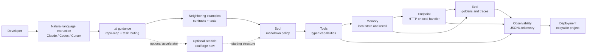

# SoulForge Architecture

SoulForge is an AI-native agent engineering substrate. Its primary user experience is a developer giving a natural-language instruction to Claude, Codex, Cursor, an OpenAI agent, or another coding system inside this repo. The architecture exists to make that agent successful: quick navigation, explicit contracts, predictable file placement, eval-backed development, observable execution, and replayable workflows.

SoulForge is not centered on a CLI or framework runtime. The generator is a supporting accelerator. The repository structure is the product surface.

## Layers

```text
AI guidance     -> .ai/
optional scaffold -> generator/
agent policy    -> souls/
capabilities    -> tools/
interfaces      -> endpoints/
state           -> memory/
verification    -> eval/
telemetry       -> observability/
research        -> research/
```

Implementation belongs in the primitive folders. `.ai/` is the machine-readable navigation layer. `generator/` is an optional source of known-good starting structures and smoke-tested examples. Neither orchestrates agents at runtime.

## Composition



## Primitive Contracts

| Primitive | Inputs | Outputs | Side effects | Replay guarantee |
| --- | --- | --- | --- | --- |
| `souls/` | Markdown with validated frontmatter | Human-readable policy | None | Versioned markdown diffs |
| `tools/` | Typed schema inputs | Schema-validated objects | External calls, local side effects | Receipts and typed errors |
| `endpoints/` | HTTP/local requests | Structured responses | Tool calls, payment checks | Request and receipt traces |
| `memory/` | Records, transcripts, recall text | JSON/SQLite records | Local persistence | Provenance and transcript hashes |
| `eval/` | Souls and goldens | Scores, traces, cache | Local JSONL/cache writes | Deterministic replay |
| `observability/` | Cost, latency, error, receipt events | JSONL events | Local append-only files | Trace/session/turn IDs |

## Economic Boundary

Base-native economic actions are tool calls, not soul fields and not framework lifecycle hooks. A soul may define policy and refusal conditions. A tool owns executable contracts and safety checks.

```text
soul policy -> typed economic tool -> cap/payment boundary -> Base/Bankr -> receipt -> obs/eval/memory
```

Required controls:

- dry-run default
- explicit live flag
- network allowlist
- spending cap
- idempotency key
- scoped wallet or sub-account
- receipt persistence
- observability event

## AI-Native Design

Most repos are difficult for coding agents because architecture is implicit. SoulForge makes it explicit:

- `.ai/repo-map.json` tells agents where things live.
- `.ai/task-routing.md` maps natural-language requests to primitives.
- Examples show the same file structure repeatedly.
- Templates provide optional known-good starting structures.
- Tools expose typed contracts.
- Eval goldens define expected behavior.
- Observability makes side effects inspectable.
- Docs state invariants near the code they govern.

## Natural-Language Task Routing

When an AI coding agent receives a request, it should translate the request into primitives before writing code:

| User asks for | Required primitives |
| --- | --- |
| Research agent | `souls/`, local tools, endpoint/example, eval, observability |
| Agent with memory | `memory/`, reflection, recall, memory failure tests |
| x402-paid agent | endpoint payment boundary, receipt capture, eval, observability |
| Bankr or trading agent | `tools/bankr/`, dry-run default, caps, idempotency, receipts |
| Long-horizon monitor | memory checkpoints, idempotent actions, scheduler docs, eval replay |
| Planner/executor | planner soul, executor tool, typed handoff records, trace capture |

The generator can accelerate this routing, but the agent must still inspect and wire the relevant primitives directly.

## Agent Loop vs. Deterministic Step Graph

Every multi-step soul faces a structural choice: does the model control the sequence, or does the developer?

| Dimension | Agent loop | Deterministic workflow |
| --- | --- | --- |
| Who decides next step | The model at runtime | The developer at design time |
| Correct when | Required steps are unknowable in advance | Required steps are fully known before execution |
| Failure mode | Model improvises a bad sequence | Typed mismatch halts and surfaces the bug early |
| Replayability | Hard — model may choose differently on retry | Easy — checkpoint per step, resume from last good state |
| Soul to use | `tool-planner` or open-ended soul | `deterministic-workflow` soul |

**Prefer deterministic workflows** when: the pipeline maps a known data shape through a known sequence of transformations. Research-fetch → extract → draft → publish is always that sequence; the model should not reorder it.

**Prefer agent loops** when: the next step depends on what the previous step returned in a way that cannot be specified upfront. Debugging an unknown codebase, answering questions across an unfamiliar document corpus, or planning in a dynamic environment all require the model to decide what to do next.

**Typed handoff records** are the key invariant for deterministic workflows. Each step declares its input and output schema. The state flowing between steps is a named record, not an untyped context blob. See `souls/examples/deterministic-workflow-soul.md` for the reference pattern.

**Checkpoint after every step.** A deterministic workflow without checkpoints cannot be debugged or resumed. The checkpoint is a serialized copy of the handoff record after a successful step — enough to restart from that point without re-running earlier steps.

## What This Is Not

- Not a runtime package.
- Not a provider wrapper.
- Not a hidden orchestrator.
- Not a LangChain, AutoGPT, or plugin-runtime clone.
- Not a place for generated opaque soul formats.

The bet: agents should be easy to create, hard to create incorrectly.
